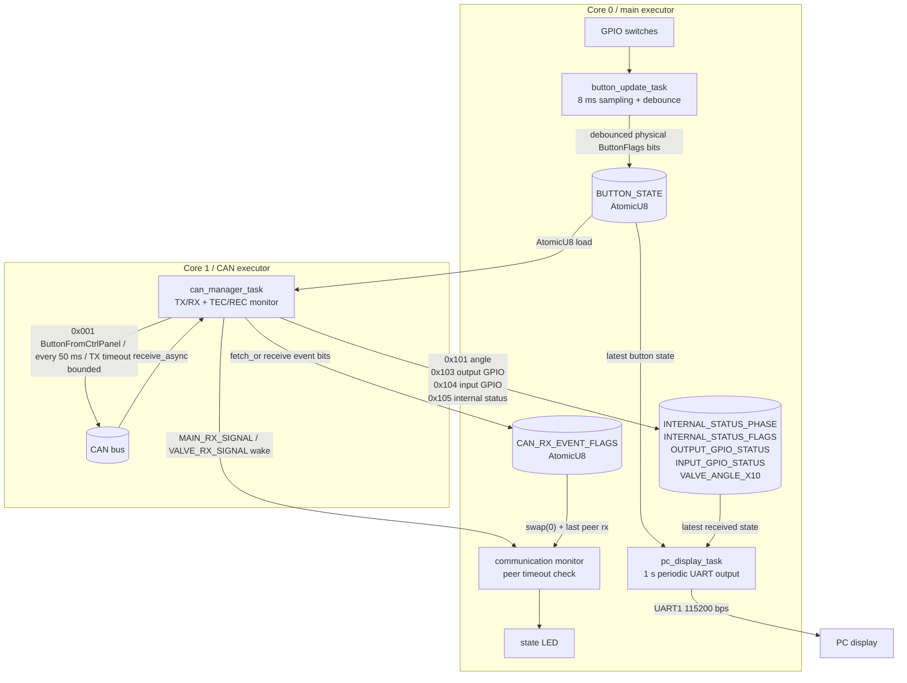

# c99l_controller_panel

ESP32 向けの制御パネル用ファームウェアです。

GPIO のスイッチ入力を読み取り、CAN 通信で射点にある integrated board へ送信し、CAN で受信した integrated board の状態、GPIO 状態、メインバルブ角度を UART1 経由で PC に表示します。

## タスク構成

`button_update_task` と `pc_display_task` は `#[esp_rtos::main]` 側の executor で起動します。CAN は `start_second_core` で起動した 2 コア目の executor 上で `can_manager_task` が TWAI 本体を所有し、送信・受信・TEC/REC 監視・Bus-Off 検出をまとめて担当します。

## CAN protocol

CAN protocol 定義は `src/can/protocol.rs` にあり、integrated board 側の `src/can/protocol.rs` と同じ ID / payload / DLC です。処理対象は Standard ID のみです。Extended ID、無関係な ID、DLC が期待値と違うフレームは状態更新に使いません。

| CAN ID | message | DLC | payload |
| --- | --- | --- | --- |
| `0x001` | `ButtonFromCtrlPanel` | 1 | button flags / reset ack raw `u8` |
| `0x101` | `MainValveAngleToCtrlPanel` | 2 | little-endian `i16` `angle_x10` |
| `0x103` | `OutputGpioStatus` | 1 | output GPIO bits `u8` |
| `0x104` | `InputGpioStatus` | 1 | input GPIO bits `u8` |
| `0x105` | `InternalStatus` | 2 | `[phase, flags]` |

現行 protocol では `0x102` と `0x107` は使いません。

`ButtonFromCtrlPanel` payload:

| bit | flag | 内容 |
| --- | --- | --- |
| 0 | `DUMP` | DUMP |
| 1 | `FIRE` | FIRE |
| 2 | `FILL` | FILL |
| 3 | `SEPARATE` | SEPARATE |
| 4 | `VALVE_SET` | VALVE_SET |
| 5 | `O2` | O2 |
| 6 | `VALVE_OPEN` | VALVE_OPEN |
| 7 | `RESET_ACK` | software one-shot reset ack |

`RESET_ACK` は物理ボタンではなく、Integrated Board の recoverable CAN fault を解除するための software one-shot ack です。`RESET_ACK` は必ず `0x80` 単独で送り、他の command bit と同時送信しません。Integrated Board 側は bit7 の立ち上がり edge を見るため、`0x80` を連続送信せず、`0x80` の後は `0x00` または通常 command payload で bit7=0 の送信を挟みます。

## 各タスクの役割

### `button_update_task`

GPIO16/18/34/17/35/39/36 のスイッチ状態を周期的に読み取ります。読み取った状態は `ButtonFlags` として組み立て、`u8` のビット列として履歴バッファに保存します。

チャタリング除去は 4 サンプル分の `u8` 履歴で行います。4 回連続で High だったビットだけを ON、4 回連続で Low だったビットだけを OFF にし、それ以外の不安定なビットは前回値を維持します。確定した結果は `BUTTON_STATE: AtomicU8` に保存します。

ボタンの bit0-6 は CAN プロトコルと一致します。bit7 `RESET_ACK` は物理ボタンではなく、`button_update_task` では立てません。

| bit | flag | 内容 |
| --- | --- | --- |
| 0 | `DUMP` | 脱圧 |
| 1 | `FIRE` | 点火 |
| 2 | `FILL` | 充填 |
| 3 | `SEPARATE` | 切り離し |
| 4 | `VALVE_SET` | バルブセット |
| 5 | `O2` | O2 |
| 6 | `VALVE_OPEN` | メインバルブ開 |
| 7 | `RESET_ACK` | Integrated Board の recoverable CAN fault 復帰用 software one-shot ack |

`RESET_ACK` は `can_manager_task` が必要なときだけ送信する software ack です。Integrated Board が reset ack を `raw == 0x80` かつ bit7 の立ち上がり edge として扱うため、他の command bit と同時送信せず、`0x80` を連続送信しません。

### `can_manager_task`

`Twai<'static, Async>` を split せずに所有し、CAN 送信、CAN 受信、エラーカウンタ監視、Bus-Off 検出、Bus-Off 中の送信抑制を 1 タスク内で行います。

`BUTTON_STATE` を `ButtonFlags::from_bits_truncate` で復元し、CAN 送信用の payload を作ります。送信 payload は 1 バイトの `u8` です。生成した payload は `GseCanMessage::ButtonFromCtrlPanel { raw }` として CAN ID `0x001` で 50 ms ごとに送信します。

送信時には安全条件を反映します。

- `DUMP` はそのまま送信
- `FIRE` は `FILL` が押されていないときだけ送信
- `FILL` はそのまま送信
- `SEPARATE` は `FILL` が押されていないときだけ送信
- `VALVE_SET` はそのまま送信
- `O2` は `FIRE` が押されていないときだけ送信
- `VALVE_OPEN` はそのまま送信

Integrated Board から受信した `InternalStatus.flags` に以下の recoverable CAN fault が含まれると、reset ack pending を立てます。

- bit0 `CAN_PEER_LOST`
- bit1 `CAN_BUS_OFF`
- bit6 `CAN_TX_TIMEOUT`

bit7 `CAN_TX_FRAME_CREATE_FAILED` はフレーム生成失敗を示すため、自動 ack 対象にしません。reset ack pending 中でも、物理ボタンから生成した通常 command payload が `0x00` のときだけ次の button frame で `0x80` 単独を送信します。`0x80` の送信を試した後は reset ack gap pending を立て、次の送信周期では `0x00` または通常 command payload により bit7=0 を挟みます。Integrated Board 側から受信した `InternalStatus.flags` で `CAN_PEER_LOST | CAN_BUS_OFF | CAN_TX_TIMEOUT` がすべて消えたことを確認したときだけ reset ack pending を clear します。

受信は `receive_async` と周期タイマーを `select` し、受信待ちだけで送信周期や状態監視が止まらないようにします。受信フレームは `GseCanMessage::decode_standard(id, data)` で DLC を確認してから状態更新します。

| CAN ID | message | 更新する状態 | 受信通知 |
| --- | --- | --- | --- |
| `0x101` | `MainValveAngleToCtrlPanel` | `VALVE_ANGLE_X10` | `VALVE_RX_SIGNAL` |
| `0x103` | `OutputGpioStatus` | `OUTPUT_GPIO_STATUS` | `VALVE_RX_SIGNAL` |
| `0x104` | `InputGpioStatus` | `INPUT_GPIO_STATUS` | `MAIN_RX_SIGNAL` |
| `0x105` | `InternalStatus` | `INTERNAL_STATUS_PHASE`, `INTERNAL_STATUS_FLAGS` | `MAIN_RX_SIGNAL` |

`VALVE_ANGLE_X10` は CAN payload の 2 バイトを little-endian の `i16` として読み取り、0.1 度単位の角度として保存します。`can_manager_task` は受信時刻や alive/lost 判定を持たず、対象 CAN ID の状態更新後に `CAN_RX_EVENT_FLAGS` へ受信イベント bit を `fetch_or(..., Ordering::Release)` で立てます。`Signal<()>` は main 側の通信監視ループを起こす用途として使います。

受信イベント bit は以下です。

| bit | 名前 | 意味 |
| --- | --- | --- |
| 0 | `CAN_RX_EVENT_PEER` | 統合先 CAN ノードから対象フレームを受信 |
| 1 | `CAN_RX_EVENT_INTERNAL_STATUS` | `InternalStatus` を受信 |
| 2 | `CAN_RX_EVENT_OUTPUT_GPIO_STATUS` | `OutputGpioStatus` を受信 |
| 3 | `CAN_RX_EVENT_VALVE_ANGLE` | `MainValveAngleToCtrlPanel` を受信 |
| 4 | `CAN_RX_EVENT_INPUT_GPIO_STATUS` | `InputGpioStatus` を受信 |

`transmit_async` / `receive_async` の `Err` は握りつぶさず、送信/受信エラー回数と最新の TEC/REC、CAN 状態に反映します。`transmit_async` は 10 ms の timeout で待ちを打ち切り、timeout 時は `CAN_TX_ERROR_COUNT` を増やして `CAN_TX_TIMEOUT_ACTIVE` を立て、health を更新して loop に戻ります。これにより相手不在や ACK なしでも CAN task が送信待ちで固まり続けません。RX FIFO の overrun または Bus-Off を検出した場合は `clear_receive_fifo()` で受信 FIFO を破棄できる構造です。

CAN 異常時の挙動は以下です。

- `Active` / `Warning`: 通常通り 50 ms 周期で送信
- `Passive`: TEC/REC と状態を記録し、Bus-Off までは送信停止しない
- `BusOff`: `transmit_async` を呼ばず送信停止
- `Recovering`: TODO。`stop()` / `start()` による復旧手順は今後拡張

TWAI は `TWAI0`, `TwaiMode::Normal`, `BaudRate::B125K`, `into_async()`, `SingleStandardFilter::new(b"0xxxxxxxxxx", b"x", [b"xxxxxxxx", b"xxxxxxxx"])` で初期化します。CAN TX/RX GPIO は controller panel 基板配線の GPIO26/GPIO27 を維持します。

### `pc_display_task`

1 秒ごとに UART1 へ状態表示を送信します。表示内容は以下です。

- 燃焼済みかどうか
- CAN 通信状態
- internal status flags
- output/input GPIO status
- internal phase
- メインバルブ角度と `Open!` / `Close!` / `Invalid`
- 各ボタンの ON/OFF

`INTERNAL_STATUS_PHASE` は `0 => Idle`, `1 => Firing`, `2 => Timeout`, `3 => Abort` として表示します。現状の Integrated Board firmware では正常終了も phase=2 として扱われるため、phase=2 を受信した時点で `burned` を `Done` として保持します。角度表示は `VALVE_ANGLE_X10` を 0.1 度単位で表示し、`MAIN_VALVE_OPEN_ANGLE_X10` / `MAIN_VALVE_CLOSED_ANGLE_X10` と許容範囲から状態文字列を決めます。

### `lcd_display_task`

### `main.rs` の通信監視ループ

これは Embassy task ではありませんが、メイン executor 上で常に動く監視ループです。`CAN_RX_EVENT_FLAGS.swap(0, Ordering::Acquire)` で受信イベントを読み取り、`CAN_RX_EVENT_PEER` が立っていた場合だけ `last_can_peer_rx: Option<Instant>` を `Instant::now()` で更新します。`MAIN_RX_SIGNAL` と `VALVE_RX_SIGNAL` は受信時刻の根拠にはせず、監視ループを起こすために `select3` で待ちます。

統合先 CAN ノードは 1 つとして扱います。`last_can_peer_rx` が `None` の場合、最後の対象フレーム受信から `COMMUNICATION_TIMEOUT_MS`、現在は 1000 ms 以上経過した場合、または `CAN_HEALTH` が `BusOff` の場合は peer lost と判定します。peer alive の場合は状態 LED を点灯し、peer lost の場合は `ERROR_COMMUNICATION_TIMEOUT_MS` 周期で点滅します。

## 共有状態

| 名前 | 型 | 用途 |
| --- | --- | --- |
| `BUTTON_STATE` | `AtomicU8` | デバウンス後のボタン状態 |
| `INTERNAL_STATUS_PHASE` | `AtomicU8` | `InternalStatus.phase` |
| `INTERNAL_STATUS_FLAGS` | `AtomicU8` | `InternalStatus.flags` |
| `OUTPUT_GPIO_STATUS` | `AtomicU8` | `OutputGpioStatus.output_bits` |
| `INPUT_GPIO_STATUS` | `AtomicU8` | `InputGpioStatus.input_bits` |
| `VALVE_ANGLE_X10` | `AtomicI32` | 0.1 度単位のバルブ角度 |
| `MAIN_RX_SIGNAL` | `Signal<CriticalSectionRawMutex, ()>` | main 系 CAN 受信イベント |
| `VALVE_RX_SIGNAL` | `Signal<CriticalSectionRawMutex, ()>` | valve 系 CAN 受信イベント |
| `CAN_HEALTH` | `AtomicU8` | `CanHealth` の現在値 |
| `CAN_TEC` | `AtomicU8` | 最後に観測した transmit error counter |
| `CAN_REC` | `AtomicU8` | 最後に観測した receive error counter |
| `CAN_TX_ERROR_COUNT` | `AtomicU32` | `transmit_async` のエラー回数 |
| `CAN_RX_ERROR_COUNT` | `AtomicU32` | `receive_async` と invalid DLC のエラー回数 |
| `CAN_MANAGER_HEARTBEAT` | `AtomicU32` | `can_manager_task` の起床回数 |
| `CAN_RX_EVENT_FLAGS` | `AtomicU8` | main 側が peer 受信時刻を更新するための受信イベント bit |
| `CAN_TX_TIMEOUT_ACTIVE` | `AtomicBool` | 最新の CAN TX timeout 表示状態 |

`Atomic` は最新状態の共有に使い、`Signal` は監視ループの起床に使います。受信回数は数えず、通信監視では main 側が `CAN_RX_EVENT_PEER` から更新した最後の peer 受信時刻だけを見ます。
