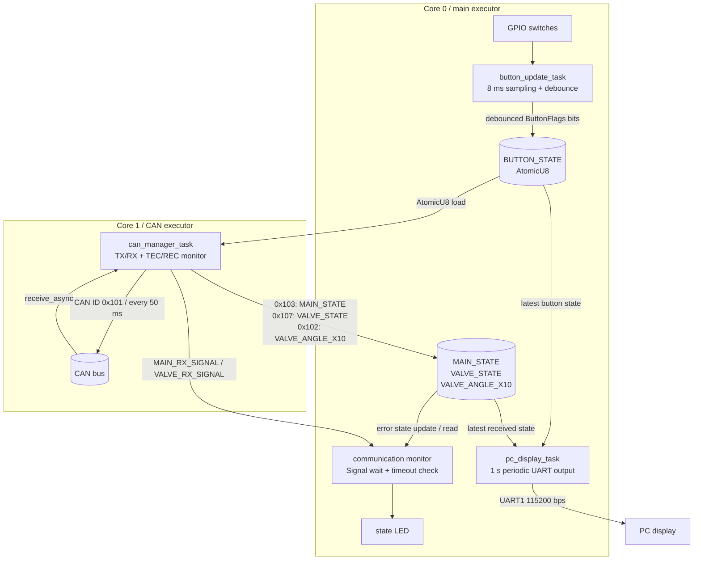

# c99l_controller_panel

ESP32 向けの制御パネル用ファームウェアです。

GPIO のスイッチ入力を読み取り、CAN通信で射点にある制御基板へ送信し、CAN で受信した制御基板・サーボの角度・通信の状態を UART1 経由で PC に表示します。

## タスク構成

`button_update_task` と `pc_display_task` は `#[esp_rtos::main]` 側の executor で起動します。CAN は `start_second_core` で起動した 2 コア目の executor 上で `can_manager_task` が TWAI 本体を所有し、送信・受信・TEC/REC 監視・Bus-Off 検出をまとめて担当します。

## 各タスクの役割

### `button_update_task`

GPIO16/18/21/17/19/34/35 のスイッチ状態を周期的に読み取ります。読み取った状態は `ButtonFlags` として組み立て、`u8` のビット列として履歴バッファに保存します。

チャタリング除去は 4 サンプル分の `u8` 履歴で行います。4 回連続で High だったビットだけを ON、4 回連続で Low だったビットだけを OFF にし、それ以外の不安定なビットは前回値を維持します。確定した結果は `BUTTON_STATE: AtomicU8` に保存します。

ボタンのビット配置は CAN プロトコルと一致します。

| bit | flag | 内容 |
| --- | --- | --- |
| 0 | `DUMP` | 脱圧 |
| 1 | `FIRE` | 点火 |
| 2 | `FILL` | 充填 |
| 3 | `SEPARATE` | 切り離し |
| 4 | `VALVE_SET` | バルブセット |
| 5 | `O2` | O2 |
| 6 | `VALVE_OPEN` | メインバルブ開 |

### `can_manager_task`

`Twai<'static, Async>` を split せずに所有し、CAN 送信、CAN 受信、エラーカウンタ監視、Bus-Off 検出、Bus-Off 中の送信抑制を 1 タスク内で行います。

`BUTTON_STATE` を `ButtonFlags::from_bits_truncate` で復元し、CAN 送信用の payload を作ります。送信 payload は従来通り 1 バイトの `u8` です。生成した payload は CAN ID `0x101` で 50 ms ごとに送信します。

送信時には安全条件を反映します。

- `DUMP` はそのまま送信
- `FIRE` は `FILL` が押されていないときだけ送信
- `FILL` はそのまま送信
- `SEPARATE` は `FILL` が押されていないときだけ送信
- `VALVE_SET` はそのまま送信
- `O2` は `FIRE` が押されていないときだけ送信
- `VALVE_OPEN` はそのまま送信

受信は `receive_async` と周期タイマーを `select` し、受信待ちだけで送信周期や状態監視が止まらないようにします。関係する Standard ID だけを処理します。

| CAN ID | 更新する状態 | 受信通知 |
| --- | --- | --- |
| `0x103` | `MAIN_STATE` | `MAIN_RX_SIGNAL` |
| `0x107` | `VALVE_STATE` | `VALVE_RX_SIGNAL` |
| `0x102` | `VALVE_ANGLE_X10` | `VALVE_RX_SIGNAL` |

`VALVE_ANGLE_X10` は CAN payload の先頭 2 バイトを little-endian の `i16` として読み取り、0.1 度単位の角度として保存します。受信時刻そのものはここでは保持せず、`Signal<()>` で通信監視ループへ受信イベントだけを通知します。

`transmit_async` / `receive_async` の `Err` は握りつぶさず、送信/受信エラー回数と最新の TEC/REC、CAN 状態に反映します。RX FIFO の overrun または Bus-Off を検出した場合は `clear_receive_fifo()` で受信 FIFO を破棄できる構造です。

CAN 異常時の挙動は以下です。

- `Active` / `Warning`: 通常通り 50 ms 周期で送信
- `Passive`: TEC/REC と状態を記録し、Bus-Off までは送信停止しない
- `BusOff`: `transmit_async` を呼ばず送信停止
- `Recovering`: TODO。`stop()` / `start()` による復旧手順は今後拡張

### `pc_display_task`

1 秒ごとに UART1 へ状態表示を送信します。表示内容は以下です。

- 燃焼済みかどうか
- バルブ通信状態
- メイン基板状態
- メインバルブ角度と `Open!` / `Close!` / `Invalid`
- 各ボタンの ON/OFF

`MAIN_STATE == 1` を一度でも受け取ると `burned` を `Done` として保持します。角度表示は `VALVE_ANGLE_X10` を 0.1 度単位で表示し、`OPEN_ANGLE` / `CLOSE_ANGLE` と許容範囲から状態文字列を決めます。

### `lcd_display_task`

### `main.rs` の通信監視ループ

これは Embassy task ではありませんが、メイン executor 上で常に動く監視ループです。`MAIN_RX_SIGNAL` と `VALVE_RX_SIGNAL` を `select3` で待ち、受信した側の `last_main_rx` / `last_valve_rx` を更新します。100 ms タイマーでも起床し、最後の受信時刻から `COMMUNICATION_TIMEOUT_MS` を超えたかを判定します。

メイン基板とバルブ系の両方が生きている場合は状態 LED を点灯し、どちらかがタイムアウトした場合は `ERROR_COMMUNICATION_TIMEOUT_MS` 周期で点滅します。タイムアウト時には `MAIN_STATE` または `VALVE_STATE` に通信エラー状態を書き込みます。

## 共有状態

| 名前 | 型 | 用途 |
| --- | --- | --- |
| `BUTTON_STATE` | `AtomicU8` | デバウンス後のボタン状態 |
| `MAIN_STATE` | `AtomicU8` | メイン基板状態 |
| `VALVE_STATE` | `AtomicU8` | バルブ系状態 |
| `VALVE_ANGLE_X10` | `AtomicI32` | 0.1 度単位のバルブ角度 |
| `MAIN_RX_SIGNAL` | `Signal<CriticalSectionRawMutex, ()>` | メイン基板 CAN 受信イベント |
| `VALVE_RX_SIGNAL` | `Signal<CriticalSectionRawMutex, ()>` | バルブ系 CAN 受信イベント |
| `CAN_HEALTH` | `AtomicU8` | `CanHealth` の現在値 |
| `CAN_TEC` | `AtomicU8` | 最後に観測した transmit error counter |
| `CAN_REC` | `AtomicU8` | 最後に観測した receive error counter |
| `CAN_TX_ERROR_COUNT` | `AtomicU32` | `transmit_async` のエラー回数 |
| `CAN_RX_ERROR_COUNT` | `AtomicU32` | `receive_async` のエラー回数 |
| `CAN_MANAGER_HEARTBEAT` | `AtomicU32` | `can_manager_task` の起床回数 |

`Atomic` は最新状態の共有に使い、`Signal` は受信イベントの通知だけに使います。受信回数は数えず、通信監視では最後に受信した時刻だけを見ます。
